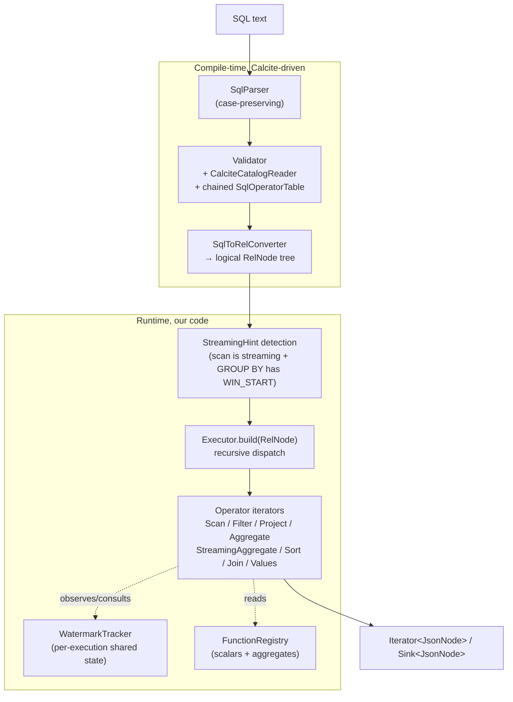
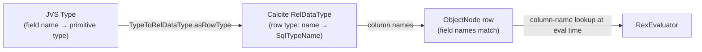
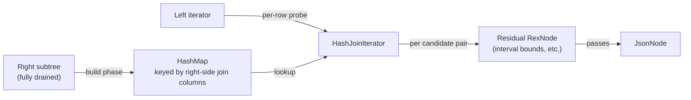

# hitorro-jvssql — Architecture

A deep-dive companion to the [README](README.md). The README shows *what*
the engine does; this doc explains *how*.

## Layered picture



**Design principle:** all compile-time work belongs to Calcite (parser,
validator, planner, optimizer); all execution is our own custom operator
tree. We deliberately don't use Calcite's `EnumerableConvention` — its
codegen model doesn't fit streaming state and would leak Calcite's
runtime types into our result rows.

## Query lifecycle

```mermaid
sequenceDiagram
    participant User
    participant Engine as JvsSqlEngine
    participant Prep as PreparedQuery
    participant Cal as Calcite
    participant Exec as Executor
    participant Ops as Operator tree
    participant Src as Iterator&lt;JVS&gt;

    User->>Engine: registerStream / registerReferenceTable / registerFunction
    User->>Engine: compile(sql)
    Engine->>Cal: parse + validate + planLogical
    Cal-->>Engine: RelNode tree
    Engine->>Prep: new PreparedQuery(engine, sql, plan)
    Engine-->>User: PreparedQuery

    User->>Prep: asIterator() (or execute(sink))
    Prep->>Exec: new Executor(plan, functions, engineConfig, lateSinks)
    User->>Prep: hasNext / next
    loop for each row
        Exec->>Ops: build tree of Iterator&lt;JsonNode&gt;
        Ops->>Src: openIterator() (on Scan)
        Src-->>Ops: JVS row
        Ops-->>Prep: JsonNode result
        Prep-->>User: row
    end
```

**One `Executor` per query execution** — it holds `WatermarkTracker` state
that only makes sense for a single run. `PreparedQuery` can be re-used
across executions provided the underlying `Iterator<JVS>` sources can be
re-opened (reference tables can; streaming sources typically can't).

## Module layout

| Package | Purpose |
|---|---|
| `com.hitorro.jvssql` | Top-level: `JvsSqlEngine`, `PreparedQuery`, `JvsSqlException` |
| `com.hitorro.jvssql.config` | `EngineConfig`, `StreamConfig`, `RefreshPolicy` |
| `com.hitorro.jvssql.schema` | Calcite `Schema`/`Table` adapters (`JvsSchema`, `JvsTable`, `TypeToRelDataType`) |
| `com.hitorro.jvssql.exec` | Every operator + `RexEvaluator` + `FunctionRegistry` + `WatermarkTracker` |
| `com.hitorro.jvssql.udf` | Java + Groovy UDF/UDAF wrappers; Calcite stub classes |
| `com.hitorro.jvssql.refdata` | Reference-table loader + spec |
| `com.hitorro.jvssql.source` | `StreamSources` (NDJSON/JSON-array readers), `SessionWindows` |
| `com.hitorro.jvssql.examples` | 16 runnable `main()` demos |

## Type-system integration



- `TypeToRelDataType.asRowType` walks the JVS `Type` via `TypeVisitor`
  and builds a Calcite `RelDataType` with one column per top-level field.
  `core_long` → BIGINT, `core_string` → VARCHAR, `core_mls` → ANY,
  everything unrecognized → ANY.
- Column names come from the JVS `Field.getName()` and are preserved
  case-insensitively (we set `SqlParser.Config.withUnquotedCasing(UNCHANGED)`
  and `withCaseSensitive(false)`).
- Undeclared dynamic fields are unreachable via bare identifiers — users
  must wrap them in `JPATH('some.dotted.path')`.

## Operators

Every operator is an `Iterator<JsonNode>` that pulls from an upstream
iterator. `Executor.build(RelNode)` walks the plan recursively and wraps
each node:

| Calcite RelNode | Our operator | Notes |
|---|---|---|
| `TableScan` | `ScanIterator` | Reads from `JvsTable.openIterator()`; wraps in `WatermarkFilter` when streaming |
| `Filter` | `FilterIterator` | `rex.evalBool(condition, row)` per row |
| `Project` | `ProjectIterator` | Evaluates each expression per row |
| `Aggregate` | `HashAggregate` OR `StreamingAggregate` | Detection via `StreamingHint` picks which |
| `Sort` | `sliceIterator` around `ExternalMergeSort` | Spills to BaseFile when in-memory buffer exceeds budget |
| `Join` | `HashJoinIterator` | Equijoin + residual condition (interval joins) |
| `Values` | Materialized `ArrayList` iterator | `VALUES (…), (…)` literals |

Anything else throws — the engine explicitly does not silently degrade.

### Aggregate — batch vs streaming

The plan-time detection:

```java
private StreamingHint detectStreamingWindow(Aggregate agg, int[] groupCols) {
    if (!(agg.getInput() instanceof Project proj)) return null;
    for (int gi = 0; gi < groupCols.length; gi++) {
        RexNode e = proj.getProjects().get(groupCols[gi]);
        if (e is a WIN_START(event_time_col, size_literal) call
            && findStreamAllowedLateness(agg.getInput()) is non-null) {
            return new StreamingHint(gi, size, lateness);
        }
    }
    return null;
}
```

If any GROUP BY column is derived from `WIN_START(...)` and the underlying
scan is a streaming source, use `StreamingAggregate`; otherwise use the
batch hash aggregate.

### Streaming aggregate — memory bound

```mermaid
graph TB
    Scan[Scan + WatermarkFilter]
    Proj[Project — computes WIN_START]
    SA[StreamingAggregate]
    Wm["WatermarkTracker<br/>(shared)"]
    Out["Iterator&lt;JsonNode&gt;"]

    Scan -->|JVS rows| Proj
    Scan -->|observe(event_time)| Wm
    Proj -->|rows with window_start col| SA
    Wm -->|maxObservedEventTime| SA
    SA -->|emit closed windows| Out

    subgraph State["StreamingAggregate state (bounded)"]
        Map["NavigableMap&lt;window_start,<br/>Map&lt;group_key, accumulator&gt;&gt;"]
    end

    SA -.holds.-> Map
```

- Batch aggregate memory: `O(total_windows × distinct_group_keys)` — holds
  everything until end-of-input
- Streaming aggregate memory: `O(active_windows × distinct_group_keys)` —
  closed windows are emitted and their state dropped
- Watermark source: `WatermarkTracker.maxObservedEventTime` (set by
  `WatermarkFilter`), with fallback to `maxObservedWindowStart` if no
  tracker was wired (e.g. non-streaming source)

Closure rule: window at `ws` is closable when
`ws + windowSize + allowedLateness ≤ watermark`.

### Sort — spill discipline

`ExternalMergeSort.sort(source, comparator, memoryBudgetRows, spillDir)`:

1. Fill in-memory buffer until `memoryBudgetRows`
2. Sort buffer in place; write as NDJSON "run" file to `spillDir`
3. Clear buffer, continue reading
4. At end-of-input: sort the residual in-memory buffer, then k-way-merge
   it against all spill runs via a `PriorityQueue<Node>`
5. Spill files deleted at end of iteration

Row-count budget = `EngineConfig.memoryBudgetMB × 5000 rows/MB` (rough
default; tune per workload).

### Hash join — equijoin + residual



- Reference tables (registered via `registerReferenceTable`) short-circuit
  the build phase — the hash index is built from the pre-loaded snapshot
  each execution
- Stream × stream inner joins fully materialize the right side (memory
  cost proportional to right stream cardinality) — for very large right
  streams you'd want a streaming symmetric hash join, which we don't have
- The `residual` is what makes interval joins work: `JoinInfo.analyzeCondition`
  gives us `leftKeys`/`rightKeys` (the hash portion) and
  `getRemaining(rexBuilder)` (the non-equi portion), which we evaluate
  on each combined row

## Watermark propagation

```mermaid
sequenceDiagram
    participant Src as Iterator&lt;JVS&gt;
    participant WF as WatermarkFilter
    participant WT as WatermarkTracker
    participant SA as StreamingAggregate
    participant Late as LateDataSink

    loop each source row
        Src->>WF: next()
        WF->>WF: extract event_time
        alt event_time < maxObserved - allowedLateness
            WF->>Late: add(row)  (drop from stream)
        else in-order or within lateness
            WF->>WT: observe(event_time)
            WF-->>SA: row
            SA->>WT: read maxObservedEventTime
            SA->>SA: close windows where <br/>ws+size+lateness ≤ watermark
            SA-->>Downstream: emit closed windows
        end
    end
```

Late-data policy applies at the scan level. The `WatermarkFilter`:
- Extracts `event_time` from the JVS row via `Propaccess`
- Compares against `maxObservedEventTime - allowedLatenessMillis`
- If below → routes to the late-data sink (if any) or silently drops
- Otherwise → advances `maxObservedEventTime` and updates the tracker

## Function dispatch

```mermaid
graph LR
    RexCall[RexCall in a Project/Filter/etc]
    RexEval[RexEvaluator.evalCall]
    Built[Built-in operators<br/>AND/OR/=/</>/LIKE/IN/...]
    Named[Named function dispatch<br/>by call.getOperator().getName]
    FR[FunctionRegistry.getScalar]
    Impl[ScalarFn / built-in / Java UDF / Groovy UDF]

    RexCall --> RexEval
    RexEval --> Built
    RexEval --> Named
    Named --> FR
    FR --> Impl
```

Standard SQL operators (comparisons, boolean logic, arithmetic, LIKE, IN,
BETWEEN, CASE, COALESCE, CAST, IS NULL) are handled directly in
`RexEvaluator.evalCall`. Everything else — including string/math scalars,
JVS-specific `JPATH`/`MLS`/`WIN_*`, and user-registered functions — goes
through `FunctionRegistry` name lookup and dispatches to a `ScalarFn`.

Calcite validator sees these functions via `SchemaPlus.add(name,
ScalarFunctionImpl.create(reflectedMethod))`. For Groovy UDFs we register
per-arity `GroovyStubs.stubN` methods — signatures Calcite type-checks
against — while runtime dispatch bypasses the stub and uses the registry.

## Extension points

### Custom scalar function (Java class)

```java
public class MyFn {
    public String eval(String s) { return s.toUpperCase(); }
}
engine.builder().registerFunction("MY_FN", MyFn.class)
```

The class must be public with a public no-arg constructor and exactly
one public `eval(...)` method whose parameter/return types Calcite can
map to SQL types.

### Custom aggregate (Java UDAF)

```java
public class Concat {
    public Object init() { return new StringBuilder(); }
    public Object add(Object acc, Object v) { ((StringBuilder)acc).append(v); return acc; }
    public Object result(Object acc) { return acc.toString(); }
}
engine.builder().registerAggregate("CONCAT", Concat.class)
```

Accumulator must be mutable — the engine holds the same reference across
all rows in a group.

### Custom source

Any `Iterator<JVS>` can be registered as a stream. `StreamSources.ndjson`,
`StreamSources.jsonArray`, and `StreamSources.autoDetect` cover the
file-shaped cases; anything else is your own iterator implementation
(Kafka consumer, HTTP long-poll, in-memory buffer, etc.).

### Custom operators (advanced)

Add a new case to `Executor.build(RelNode)` for a `RelNode` subclass
Calcite might emit. Not typically needed — every SQL construct the parser
accepts lowers to the RelNode types we already handle. If you find one
that doesn't, it's a bug.

## Debugging a query

- **Print the physical plan**: temporarily wrap `Executor.execute()` in
  `System.err.println(org.apache.calcite.plan.RelOptUtil.toString(plan))`.
  Full plan tree lands on stderr.
- **Trace which operator gets built**: add a `System.err.println` in
  each `build*` method.
- **Watermark observability**: `WatermarkTracker.maxObservedEventTime()`
  is public — expose it from `Executor` if you want dashboards.
- **Late-data volume**: register a counting `Sink` via
  `withLateDataSink(streamName, sink)` and read its counter.

## Performance model

| Operator | Complexity | Memory |
|---|---|---|
| Scan + WatermarkFilter | O(N) | O(1) |
| Filter | O(N) | O(1) |
| Project | O(N × cols) | O(1) |
| HashAggregate (batch) | O(N) | O(distinct_groups) |
| StreamingAggregate | O(N) | O(active_windows × groups_per_window) |
| ExternalMergeSort | O(N log N) worst | O(memoryBudget) + O(N) disk |
| HashJoin (stream × ref) | O(L + R) | O(R) hash + O(match_fanout) live |
| HashJoin (stream × stream) | O(L + R) | O(R) hash |
| Interval join residual | +O(matches_per_key) per left row | — |

N = input rows. L/R = left/right join input sizes. Streaming operators
never hold more than one row + open-window state at a time.

## What we deliberately don't do

- **Calcite's cost-based optimizer** — logical plan goes straight to
  execution. When we add streaming SQL rules and stateful physical operators
  as full `RelNode` types, we'll turn Volcano back on.
- **Runtime code generation** — the interpreter is fast enough for JVS-shaped
  workloads; codegen adds complexity and hurts observability.
- **`Iterator<Object[]>`-style row shapes** — everything stays as
  `JsonNode`. Serialization boundaries are fewer, and output rows are
  ready for JSON emission with no re-marshalling.

## Extending the language

To add a new SQL syntax that Calcite doesn't parse natively:

1. **Rewriter approach** — pre-process the SQL string before handing it to
   `SqlParser`. Trivial for simple sugar (`content->'en'` → `MLS(content,
   'en')`).
2. **Custom SqlOperator + parser extension** — Calcite supports parser
   extensions via `SqlParserImplFactory`. More involved but no string
   munging.

For scalar behavior only (no new syntax), the `registerFunction` path
covers 99% of extensions.
