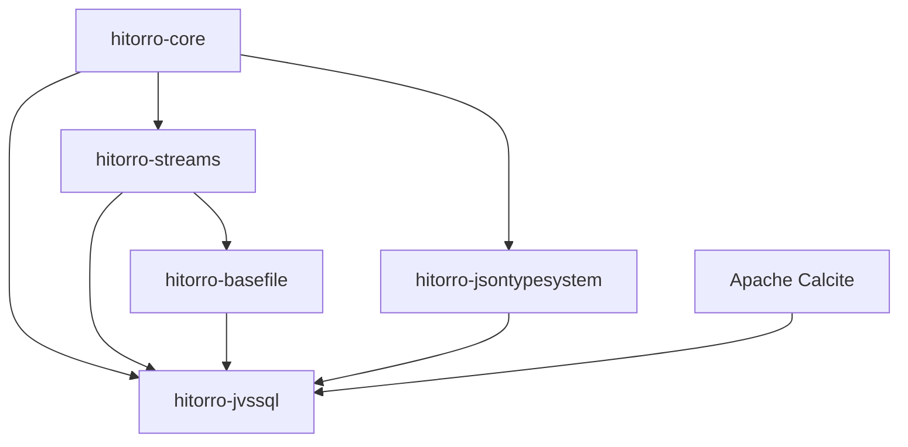
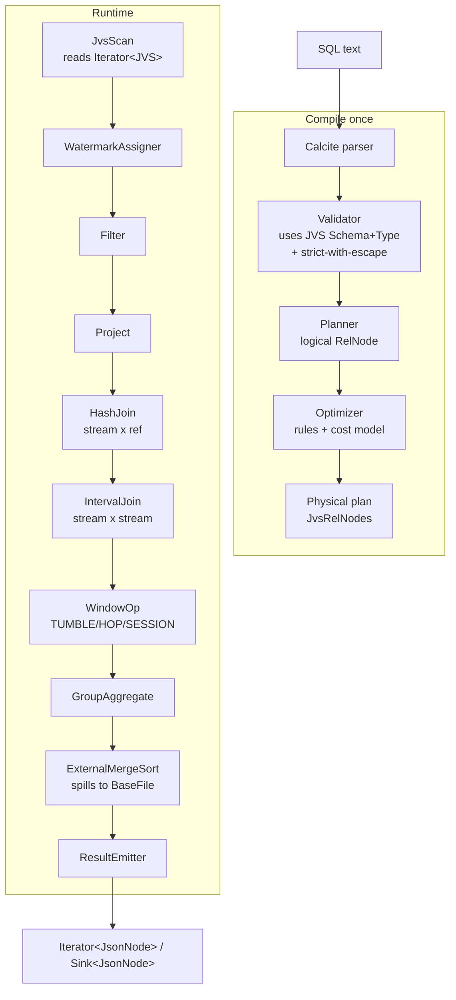

# hitorro-jvssql

Streaming SQL engine over iterators of JVS (JSON-with-schema) documents.

Built on Apache Calcite for parsing / semantic analysis / relational-algebra
planning / cost-based optimization. The executor is our own, operates on
`Iterator<JVS>`, integrates the JVS type system for schema validation, and
emits `JsonNode` result records — either as an `AbstractIterator<JsonNode>`
you pull from, or pushed into a `Sink<JsonNode>` you supply.

Replaces the older `hitorro-jsonsql` module (which used JSQLParser + a
custom "Latch" typed-expression system).

## Position in the HiTorro dependency graph



## What it does

- **Full SQL surface**: SELECT / WHERE / GROUP BY / HAVING / ORDER BY / JOIN /
  subqueries / CASE / IN / BETWEEN / LIKE / date+string+math functions — courtesy
  of Calcite parser + validator + planner
- **Streaming semantics**: TUMBLE / HOP / SESSION time windows with event-time
  attributes and watermarks (SQL WATERMARK clause on registered streams)
- **JOINs**: stream × reference-table (dimension lookup, hash-indexed) and
  stream × stream interval joins (both sides buffered by watermark)
- **Sort with spill-to-disk**: external merge sort, spills to a spillable
  `BaseFile` directory when the in-memory buffer overflows
- **Type-system integration**: bare identifiers must resolve to a field on the
  registered JVS Type (strict-with-escape); `DYNAMIC('some.dotted.path')`
  reads undeclared fields as ANY
- **First-class MLS**: `MLS(content, 'en')` scalar for multi-language string
  envelopes
- **UDF + UDAF**: register Java implementations (`ScalarFunction` /
  `AggregateFunction`) or Groovy scripts
- **Result records**: nested `JsonNode` per output row — window bounds nested
  as `{"window": {"start": …, "end": …}, …}`

## Quick example

```java
JvsSqlEngine engine = JvsSqlEngine.builder()
    .withSpillDirectory(spillDir)                    // BaseFile
    .withMemoryBudgetMB(512)
    .registerStream("docs", jvsIterator, docType,
        StreamConfig.builder()
            .eventTimeField("created_at")
            .allowedLatenessMillis(30_000)
            .build())
    .registerReferenceTable("users", usersFile, userType)
    .withLateDataSink("docs", lateDataSink)
    .registerFunction("hash64", Hash64Fn.class)      // Java UDF
    .registerGroovyFunction("normalize_email",       // Groovy UDF
        "return arg.toString().toLowerCase().trim()")
    .build();

PreparedQuery q = engine.compile("""
    SELECT u.department AS dept,
           TUMBLE_START(created_at, INTERVAL '1' HOUR) AS window_start,
           COUNT(*) AS n,
           SUM(d.file_size) AS total_bytes,
           MLS(d.content, 'en') AS body_en
    FROM   docs d
    JOIN   users u ON normalize_email(d.author) = normalize_email(u.email)
    WHERE  d.classification IN ('internal', 'public')
    GROUP BY u.department, TUMBLE(created_at, INTERVAL '1' HOUR)
    ORDER BY total_bytes DESC
""");

// Pull:
AbstractIterator<JsonNode> rows = q.asIterator();
while (rows.hasNext()) { ... }

// Push:
q.execute(mySinkOfJsonNode);
```

## Type-system integration

```sql
-- OK: filename is declared on the type
SELECT filename FROM docs WHERE file_size > 1000

-- OK: dotted traversal into declared MLS field
SELECT MLS(content, 'en') AS body FROM docs

-- OK: explicit escape hatch for undeclared fields
SELECT DYNAMIC('metadata.experimental_flag') AS x
FROM docs WHERE x IS NOT NULL

-- Error at plan time (typo not on the type, no DYNAMIC):
SELECT filenaem FROM docs
```

## Reference tables

A reference table is a secondary lookup table that you JOIN a stream against.
It's loaded from a `BaseFile` at engine build, hash-indexed by the join key,
and consulted for every incoming stream record. Three refresh modes:

```java
// Load once at build time
.registerReferenceTable("users", usersFile, userType)

// Reload every hour (atomic swap; in-flight queries see old snapshot until swap)
.registerReferenceTable("users", usersFile, userType,
    RefreshPolicy.every(Duration.ofHours(1)))

// Manual reload only
.registerReferenceTable("users", usersFile, userType,
    RefreshPolicy.onDemand())
engine.refreshReferenceTable("users");
```

## Windowed aggregation output

For `SELECT dept, TUMBLE_START(created_at, INTERVAL '1' HOUR) AS ws, SUM(file_size) AS total ... GROUP BY dept, TUMBLE(created_at, INTERVAL '1' HOUR)`:

```json
{"window": {"start": "2026-08-12T09:00:00Z", "end": "2026-08-12T10:00:00Z"},
 "dept":   "engineering",
 "total":  12345678}
```

Rows are emitted when the watermark passes `window_end`. Records with
`event_time < watermark - allowedLateness` are routed to the late-data sink
(if registered) or silently dropped.

## Phased delivery

Implemented in phases. Every phase is a working, tested, shippable engine.

- **Phase 1 — batch foundation** *(current)*: module skeleton + Calcite
  wiring + Scan / Filter / Project / HashAggregate / HashJoin (stream × ref)
  / ExternalMergeSort with spill. Everything except windowing.
- **Phase 2**: event-time + watermarks + TUMBLE
- **Phase 3**: HOP + SESSION
- **Phase 4**: stream × stream interval JOIN

## Architecture



## Building

```bash
# from the reactor root
mvn install -DskipTests -pl hitorro-jvssql -am

# just this module
cd hitorro-jvssql && mvn install -DskipTests
```

Java 21 is required.

## Dependencies

| Kind | Group / artifact | Why |
|------|------------------|-----|
| Internal | `com.hitorro:hitorro-core` | Log, Env, StringUtil, HTAssert |
| Internal | `com.hitorro:hitorro-streams` | AbstractIterator, BaseSink, ThreadedQueue |
| Internal | `com.hitorro:hitorro-basefile` | BaseFile for spill / reference-table loading |
| Internal | `com.hitorro:hitorro-jsontypesystem` | JVS, Type, Field, Propaccess |
| Runtime | `org.apache.calcite:calcite-core` | SQL parser, validator, planner, optimizer |
| Provided | `org.apache.groovy:groovy` | Groovy-defined UDF / UDAF (optional at runtime) |

## Status

Alpha. Phase 1 in progress.

## License

MIT (see the parent `hitorro-all` repo).
